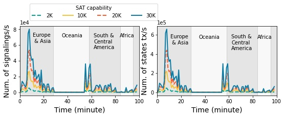

## Figure 12: Temporal dynamics of a fast-moving LEO satellite’s signaling overhead in Option 3 (Figure 6c).

<div align=center></div>

### What is this figure about

Figure 12 shows the temporal dynamics of Starlink’s signaling overhead. 
Signaling overhead is bursty as static users in the same area simultaneously enter an incoming satellite’s coverage. It also varies over time as each satellite traverses different global locations. 
Stateful functions in these LEO satellites should maintain the sensitive states shown in this figure from numerous users and traverse globally.

### Experimental Methodology

We follow experiment in Figure 9 to show the instantaneous changes in the signal and state migration of a single satellite over time.

### How to run the code
```
jupyter notebook
Open figure12.ipynb file and run notebook
```

### Data
The data can be found in the `data/` folder.

	|- data
		|- starlink
			|- distributedscenario_a_2000.npy: This file shows signaling migration overhead in scanario a with capacity of 2000. Shape of this file is (99, 1584, 2), which contains byte migration overhead and signaling migration overhead during 99 sets of time slice switching, on 1584 satellites.
			|- distributedscenario_a_10000.npy
			|- ...
		|- 245ponits.npy: This file shows the Subsatellite trajectory of the selected satellite within 100 minutes.

