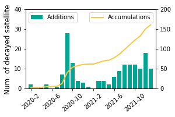
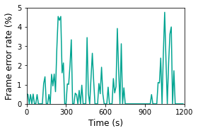

## Figure 13: Intermittent failures in mobile satellites

<div align=center></div>


### What is this figure about

These two figures shows intermittent satellite failures from radiation (figure13a) and unreliable wireless links (figure13b). 

As shown in Figure 13a, every 1 out of 40 Starlink satellites may have failed since they use commodity CPUs without hardening against radiations (for cost reasons). Moreover, all satellite links are wireless and thus prone to intermittent disconnections (e.g., out-of-alignment for laster satellite links in mobility, and atmospheric attenuation for space-ground radio links as exemplified in Figure 13b from our datasets). All procedures in Figure 10 are prone to these failures since any signaling message loss/error can block the entire procedure.


### Experimental Methodology

For figure 13a, we use publicly available data to analyze starlink satellite failures. Starlink satellites decay data is available on [Space-track](https://www.space-track.org).

For figure 13b, our experiments are based on data from China Telecom Tiantong T900 satellite phone. 

### How to run the code
```
jupyter notebook
open figure13.ipynb file and run notebook
```

### Data
The following data files can be found in the `data/` subfolder:

	|- data
		|- satcat_starlink.csv: data for figure13a, starlink satellites decay data from space-track.org. 
		|- ping-20s-300.txt: an example trace from  China Telecom Tiantong T900 satellite phone. 
		|- ping-20s-300-no-l1.txt: data for figure13b, filtering out l1 layer trace in ping-20s-300.txt, which is not helpful here. 
