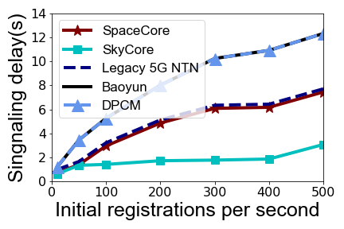

## Figure 17: Prototype results in hardware platform 1

<div align=center></div>

<div align=center></div>

<div align=center></div>

### What is this figure about

Figure 17 shows the signaling delays and satellite CPU usages in SpaceCore and other solutions. We initiate procedures in Figure 10 and 16 with varying number of users to evaluate SpaceCore’s performance and cost. 
As shown in Figure 17, SpaceCore’s lightweight, localized state management reduces 889 ms (6.90×), 1,529 ms (11.15×), 139 ms (1.92×), and 477 ms (4.16×) signaling delays in session establishment compared to the legacy 5G NTN, Baoyun, DPCM and SkyCore, respectively.


### Experimental methodology
	
For prototype evaluation, we first examine SpaceCore’s functionality in a small network with a home running full-fledged 5G protocol stacks in a ThinkStation P910, a SpaceCore satellite with Raspberry Pi 4, and terrestrial UEs emulated by [UERANSIM](https://github.com/aligungr/UERANSIM). 

We implement all solutions by deploying different functions of Open5GS to satellite on real LEO hardware and home network. In addition, we take into account the mechanisms specific to each solution, such as the additional encryption and decryption introduced by SpaceCore/DPCM, the simplification of the signaling process by SkyCore through the storage of security vectors, and so on.

We use `top` command to get CPU utilization of each solutions, and get signaling delays from logs from UERANSIM and Open5GS.

The detailed requirements of the three components are as follows:

+ Satellite:
	+ 	Hardware: Raspberry Pi 4 (represents satellites with limited computational performance).
	+  OS: Ubuntu 18.04.
	+  Software: SpaceCore based on [Open5GS](https://open5gs.org) and [OpenABE](https://github.com/zeutro/openabe), [UERANSIM](https://github.com/aligungr/UERANSIM).
+ Home network:
	+ Hardware:  ThinkStation P910 with Xeon E5-2630 (represents home network with high computational performance).
	+ OS: Ubuntu 18.04.
	+ Software: SpaceCore based on [Open5GS](https://open5gs.org) and [OpenABE](https://github.com/zeutro/openabe).
+ UE:
	+ Hardware: Lenovo Xiaoxin Chao 7000 Intel Core i5-7200U 2.5GHz Laptop.
	+ OS: Ubuntu 18.04.
	+ Software: [UERANSIM](https://github.com/aligungr/UERANSIM).

**Experiment steps**:

1. Deploy SpaceCore/core functions on satellites of other solutions and UERANSIM-gNB on satellite hardware, home network functions on home network hardware, UERANSIM-UE on any another hardware (different from the hardware where SpaceCore and home network are located).
2. Establish connections between the three, which are UE<-->Satellite<-->Home network. There are many tutorials available on how to establish connections between the three, such as:
	+ [My first 5G Core : Open5GS and UERANSIM](https://nickvsnetworking.com/my-first-5g-core-open5gs-and-ueransim/)
	+ [Open5GS 5GC & UERANSIM UE/RAN Sample Configuration](https://github.com/s5uishida/open5gs_5gc_ueransim_sample_config)
	+ [Open5GS & UERANSIM - Select nearby UPF according to the connected gNodeB](https://github.com/s5uishida/open5gs_5gc_ueransim_nearby_upf_sample_config)
3. When the three components are deployed and connections are established, you can write a script to add users in batches and trigger the signaling process.
4. Use linux `top` command to monitor cpu usage and get signaling delay results based on UERANSIM and Open5GS logs.


### How to run the code
```
jupyter notebook
open figure17.ipynb file and run notebook
```

### Data
The following data files can be found in the `data/` subfolder:

	|- data
		|- registration: 
			|- cpu: CPU utilization of core functions using linux `top` command.
				|- 10.txt: the file name `xxx.txt` indicates `xxx` registration/session establishment requests sent per second.
				|- 50.txt
				|-...
			|- delay: The logs collected with UERANSIM of registration/session establishment on the UE side.
				|- tiansuan
					|- 10.txt
					|-...
				|- ntn
				|- skycore
				|- spacecore
				|- dpcm
		|- session: Same structure as registration floder.
			|- cpu
			|- delay

