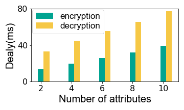

## Figure 18: SpaceCore’s local state processing costs

<div align=center></div>

### What is this figure about
Figure 18 shows SpaceCore's  extra local state processing costs (delay). 
In combination with figure 17, even with the extra local state processing delay introduced by SpaceCore, the overall delay of SpaceCore is still much lower than other solutions. 

### Experimental Methodology

ABE is introduced by SpaceCore for security purposes and is the main part of the computational resource consumption, which can be tested separately to get its additional delay.

Here are the experiment details:

+ Hardware: Raspberry Pi 4B. 
+ OS: Ubuntu 18.04.
+ Software: [OpenABE](https://github.com/zeutro/openabe).
+ Reproduction steps:
	+ Install OpenABE on Raspberry Pi 4B.
	+ Write codes to test the encryption and decryption times for different plaintext lengths and number of attributes.
	+ Process the data and plot the figure.

### How to run the code
```
jupyter notebook
open figure18.ipynb file and run notebook
```

### Data
The following data files can be found in the `data/` subfolder:

	|- data
		|- abe-len-100.txt: Encryption and decryption time and encryption length with different number of attrbutes when ciphertext length is 100.


