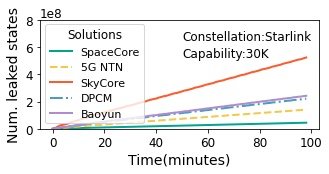
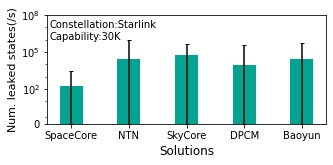

## Figure 19: Leaked sensitive states in satellite attacks

<div align=center></div>

### What is this figure about
Figure 19 shows the state leakages under satellite hijacking and man-in-the-middle passive listening of wireless inter-satellite links.
These figures are to illustrate the resiliency to satellite attacks of five solutions. 
Through comparison, we arrive at the following conclusions: SpaceCore is resilient to satellite hijacking due to its stateless nature. SpaceCore is also resilient to link failures and man-in-the-middle attacks since it localizes most state operations with few migrations.

### Experimental Methodology
We run 5 solutions in §6.1 in Starlink and ground stations in[<sup>1</sup>](#refer-anchor-1) . We assume the LEO mega-constellations use the grid satellite topology with inter-satellite traffic delivery capability and satellite capability is 30,000 users per satellite. We replay signaling datasets in Table 2 to trigger their signaling procedures.

In Figure19a, the number of leaked signalings from numerous users and traverse globally will cumulative over time. In Figure 19b, the number of leaked states without IPsec in 5 solutions per seconds varies depending on time and satellite. Thus, we calculate average number of leaked states per second per satellite and maximum and minimum values.

### How to run the code
```
jupyter notebook
Open figure19a.ipynb file and run notebook
Open figure19b.ipynb file and run notebook
```

### Data
The data can be found in the `data/` folder.

	|- data
		|-starlink
			|- distributed_old-new_SP_delay_hop.npy: This file shows the path between the old and new satellites during handover.
			|- distributed_old-end_SP_delay_hop.npy: This file shows the path between the old satellite and ground station.
			|- distributed_new-end_SP_delay_hop.npy
			|- starlink_ue_access_P_OPT.npy:This file shows the user's satellite access.
		|- starlink_per_user_ratio30000.npy: This file shows the real number of users represented by each user in starlink_ue_access_P_OPT.npy based on the satellite capacity.
		|- skycore_broadcast_SP_delay_hop: This file shows the states migration during broadcast of skycore.

### Reference

<div id="refer-anchor-1"></div>- [1] Tesmanian. SpaceX Starlink Gateway Stations Found In The United States and Abroad. https://tinyurl.com/4m5uah43, 2021.