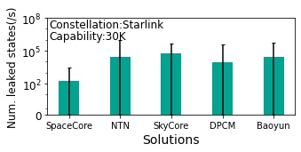

## Figure 19: Leaked sensitive states in satellite attacks

### Overview
Figure 19 shows the state leakages under satellite hijacking and man-in-the-middle passive listening of wireless inter-satellite links.
These figures are to illustrate the resiliency to satellite attacks of five solutions. 
Through comparison, we arrive at the following conclusions: SpaceCore is resilient to satellite hijacking due to its stateless nature. SpaceCore is also resilient to link failures and man-in-the-middle attacks since it localizes most state operations with few migrations.

### Experimental Methodology
We run SpaceCore and other solutions in §6.1 in Starlink and ground stations in[1] . We assume the LEO mega-constellations use the grid satellite topology[2,3] with inter-satellite traffic delivery capability and satellite capability is 30,000 users per satellite. We replay signaling datasets in Table 2 to trigger their signaling procedures.

<table>
    <caption> Table 1: LEO satellite mega-constellations today </caption>
    <thread>
    <tr>
        <th></th>
        <th>Satellites per orbit 𝑛</th>
        <th>Total orbits 𝑚</th>
        <th>Total satellites 𝑛 · 𝑚</th>
        <th>Altitude 𝐻 (km)</th>
        <th>Inclination angle 𝜙</th>
        <th>Speed</td>
    </tr>
    </thread>
    <tbody>
    <tr>
        <td>Starlink</td>
        <td>22</td>
        <td>72</td>
        <td>1,584</td>
        <td>550</td>
        <td>53°</td>
        <td>7.6km/s</td>
    </tr>
    <tr>
        <td>OneWeb</td>
        <td>40</td>
        <td>18</td>
        <td>720</td>
        <td>1,200</td>
        <td>87.9°</td>
        <td>7.3km/s</td>
    </tr>
    <tr>
        <td>Kuiper</td>
        <td>34</td>
        <td>34</td>
        <td>1,156</td>
        <td>630</td>
        <td>51.9°</td>
        <td>7.5km/s</td>
    </tr>
    <tr>
        <td>Iridium</td>
        <td>11</td>
        <td>6</td>
        <td>66</td>
        <td>780</td>
        <td>86.4° </td>
        <td>7.4km/s</td>
    </tr>
    </tbody>
</table>

<table>
    <caption> Table 2: Overview of dataset from our experiments </caption>
<thead>
  <tr>
    <th></th>
    <th colspan="3"> Mobile satellites</th>
    <th colspan="3"> Terrestrial 5G</th>
  </tr>
</thead>
<tbody>
  <tr>
    <td></td>
    <td>Inmarsat Explorer 710</td>
    <td>Tiantong SC310</td>
    <td>Tiantong T900</td>
    <td>China Telecom</td>
    <td>China Unicom</td>
    <td>China Mobile</td>
  </tr>
  <tr>
    <td>L1/L2</td>
    <td>56,231</td>
    <td>1,744,094</td>
    <td>3,887,429</td>
    <td>3,828,083</td>
    <td>1,475,393</td>
    <td>8,405,587</td>
  </tr>
  <tr>
    <td>RRC </td>
    <td>40,800</td>
    <td>4,226</td>
    <td>1,340</td>
    <td>28,841</td>
    <td>14,833</td>
    <td>69,782</td>
  </tr>
  <tr>
    <td>MM</td>
    <td>57,264</td>
    <td>43,555</td>
    <td>12,626</td>
    <td>605</td>
    <td>970</td>
    <td>4,194</td>
  </tr>
  <tr>
    <td>SM</td>
    <td>53,868</td>
    <td>4,586</td>
    <td>1,670</td>
    <td>203</td>
    <td>338</td>
    <td>925</td>
  </tr>
   <tr>
    <td>Others</td>
    <td>762,957</td>
    <td>310,455</td>
    <td>376,671</td>
    <td>N/A</td>
    <td>N/A</td>
    <td>N/A</td>
  </tr>
  <tr>
    <td>Total</td>
    <td> 971,120 </td>
    <td>2,106,916</td>
    <td>4,279,736</td>
    <td>3,857,732</td>
    <td>1,491,534</td>
    <td>8,480,488</td>
  </tr>
</tbody>
</table>

More details about other solutions are listed as follows:

(1) Legacy 5G NTN, which is the baseline. We evaluate its regeneration mode (Figure 6a); 

(2) SkyCore, which is the representative non-terrestrial mobile core (currently for UAV). It precomputes and stores all users’ security contexts and policies in UAV/satellite to minimize state transfers from the ground, and proactively synchronize states between UAVs via broadcast. 

(3) Baoyun , which is the first 5G core in real LEO satellites (Figure 6c); 

(4) DPCM , which leverages device-side state replica to accelerate the legacy signaling procedures (Figure 6c). Figure 17 shows the signaling delays and satellite CPU usages in these solutions. 

In Figure19a, the number of leaked signalings from numerous users and traverse globally will cumulative over time. In Figure 19b, the number of leaked states without IPsec in 5 solutions per seconds varies depending on time and satellite. Thus, we calculate average number of leaked states per second per satellite and maximum and minimum values.

### How to run the code

1. jupyter notebook
2. Open figure19a.ipynb file and run notebook
   Open figure19b.ipynb file and run notebook

### Data
The data can be found in the `data/` folder.

	|- data
		|-starlink
			|- distributed_old-new_SP_delay_hop.npy: This file shows the path between the old and new satellites during handover.
			|- distributed_old-end_SP_delay_hop.npy: This file shows the path between the old satellite and ground station.
			|- distributed_new-end_SP_delay_hop.npy
			|- starlink_ue_access_P_OPT.npy:This file shows the user's satellite access.
		|- starlink_per_user_ratio30000.npy: This file shows the real number of users represented by each user in starlink_ue_access_P_OPT.npy based on the satellite capacity.
		|- skycore_broadcast_SP_delay_hop: This file shows the states migration during broadcast of skycore.

### Reference

[1] Tesmanian. SpaceX Starlink Gateway Stations Found In The United States and Abroad. https://tinyurl.com/4m5uah43, 2021.

[2] Sydney Finkelstein and Shade H Sanford. Learning from corporate mistakes: The rise and fall of iridium. Organizational Dynamics, 29(2):138–148, 2000.

[3] Debopam Bhattacherjee and Ankit Singla. Network Topology Design at 27,000 km/hour. In ACM CoNEXT, 2019.