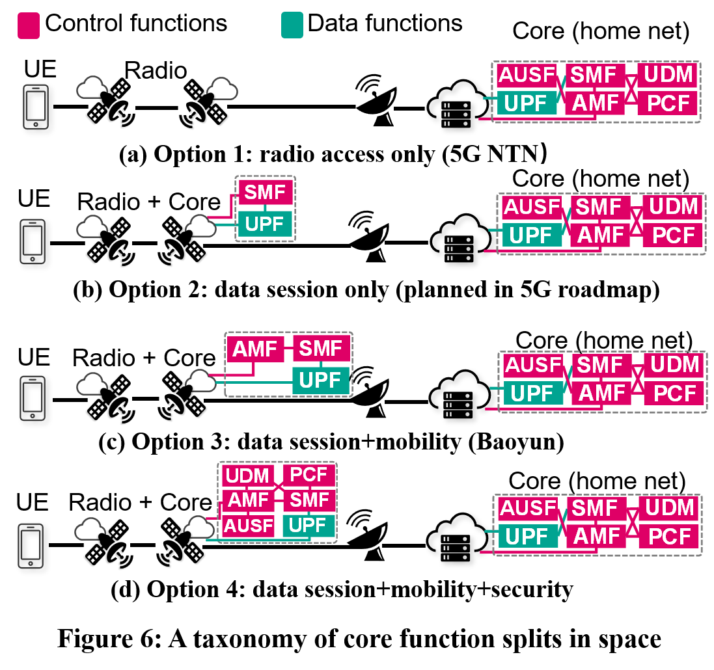

## Figure 20:  Signaling migration overhead per satellite and per ground station in five solutions.

### Overview

Figure 20 shows signaling migration overhead without failures/attacks.
This figure is to compare  SpaceCore with other four satellite solutions in LEO mega-constellations in Tabel 1.
SpaceCore significantly reduces signaling overhead compared to the other four solutions. It reduces 122.2×, 17.5×, 40.3×, and 49.3×signaling costs for satellites compared to 5G NTN, SkyCore, Baoyun, and DPCM, respectively in Starlink where capability of satellite is 30,000 users. SpaceCore eliminates the remote ground stations’s performance bottlenecks due to space-terrestrial asymmetry.

### Experimental Methodology

We run SpaceCore in LEO mega-constellations in Table 1 (based on real orbital information from  [Space-track](https://www.space-track.org)) and ground stations in[1]. 

<table>
    <caption> Table 1: LEO satellite mega-constellations today </caption>
    <thread>
    <tr>
        <th></th>
        <th>Satellites per orbit 𝑛</th>
        <th>Total orbits 𝑚</th>
        <th>Total satellites 𝑛 · 𝑚</th>
        <th>Altitude 𝐻 (km)</th>
        <th>Inclination angle 𝜙</th>
        <th>Speed</td>
    </tr>
    </thread>
    <tbody>
    <tr>
        <td>Starlink</td>
        <td>22</td>
        <td>72</td>
        <td>1,584</td>
        <td>550</td>
        <td>53°</td>
        <td>7.6km/s</td>
    </tr>
    <tr>
        <td>OneWeb</td>
        <td>40</td>
        <td>18</td>
        <td>720</td>
        <td>1,200</td>
        <td>87.9°</td>
        <td>7.3km/s</td>
    </tr>
    <tr>
        <td>Kuiper</td>
        <td>34</td>
        <td>34</td>
        <td>1,156</td>
        <td>630</td>
        <td>51.9°</td>
        <td>7.5km/s</td>
    </tr>
    <tr>
        <td>Iridium</td>
        <td>11</td>
        <td>6</td>
        <td>66</td>
        <td>780</td>
        <td>86.4° </td>
        <td>7.4km/s</td>
    </tr>
    </tbody>
</table>

We assume the LEO mega-constellations use the grid satellite topology[2,3] with inter-satellite traffic delivery capability. We replay signaling datasets in Table 2 to trigger their signaling procedures. 

<table>
    <caption> Table 2: Overview of dataset from our experiments </caption>
<thead>
  <tr>
    <th></th>
    <th colspan="3"> Mobile satellites</th>
    <th colspan="3"> Terrestrial 5G</th>
  </tr>
</thead>
<tbody>
  <tr>
    <td></td>
    <td>Inmarsat Explorer 710</td>
    <td>Tiantong SC310</td>
    <td>Tiantong T900</td>
    <td>China Telecom</td>
    <td>China Unicom</td>
    <td>China Mobile</td>
  </tr>
  <tr>
    <td>L1/L2</td>
    <td>56,231</td>
    <td>1,744,094</td>
    <td>3,887,429</td>
    <td>3,828,083</td>
    <td>1,475,393</td>
    <td>8,405,587</td>
  </tr>
  <tr>
    <td>RRC </td>
    <td>40,800</td>
    <td>4,226</td>
    <td>1,340</td>
    <td>28,841</td>
    <td>14,833</td>
    <td>69,782</td>
  </tr>
  <tr>
    <td>MM</td>
    <td>57,264</td>
    <td>43,555</td>
    <td>12,626</td>
    <td>605</td>
    <td>970</td>
    <td>4,194</td>
  </tr>
  <tr>
    <td>SM</td>
    <td>53,868</td>
    <td>4,586</td>
    <td>1,670</td>
    <td>203</td>
    <td>338</td>
    <td>925</td>
  </tr>
   <tr>
    <td>Others</td>
    <td>762,957</td>
    <td>310,455</td>
    <td>376,671</td>
    <td>N/A</td>
    <td>N/A</td>
    <td>N/A</td>
  </tr>
  <tr>
    <td>Total</td>
    <td> 971,120 </td>
    <td>2,106,916</td>
    <td>4,279,736</td>
    <td>3,857,732</td>
    <td>1,491,534</td>
    <td>8,480,488</td>
  </tr>
</tbody>
</table>

We repeat this experiment in SpaceCore and other solutions in §6.1 under varying LEO satellite capacities. More details about other solutions are listed as follows:

(1) Legacy 5G NTN, which is the baseline. We evaluate its regeneration mode (Figure 6a); 

(2) SkyCore, which is the representative non-terrestrial mobile core (currently for UAV). It precomputes and stores all users’ security contexts and policies in UAV/satellite to minimize state transfers from the ground, and proactively synchronize states between UAVs via broadcast. 

(3) Baoyun , which is the first 5G core in real LEO satellites (Figure 6c); 

(4) DPCM , which leverages device-side state replica to accelerate the legacy signaling procedures (Figure 6c). Figure 17 shows the signaling delays and satellite CPU usages in these solutions. 

### How to run the code

1.    jupyter notebook
2.    Open figure20.ipynb file and run notebook

### Data
The data can be found in the `data/` folder.

	|- data
		|- starlink_72_22
			|- opt_handover
				|- satellite
					|- distributed_solution_DPCM_state_2000_mobility.npy：This file shows signaling migration overhead in solution DPCM with capacity of 2000 during mobility management. Shape of this file is (99, 1584, 2), which contains byte migration overhead and signaling migration overhead during 99 sets of time slice switching, on 1584 satellites.
					|- distributed_solution_DPCM_state_2000_session.npy
					...
			|- distributed_new-end_SP_delay_hop.npy:llx
		|- kuiper
			|- opt_handover
				|- satellite
					|- distributed_solution_DPCM_state_2000_mobility.npy.npy
					...
			|- distributed_new-end_SP_delay_hop.npy
		...

### References

[1] Tesmanian. SpaceX Starlink Gateway Stations Found In The United States and Abroad. https://tinyurl.com/4m5uah43, 2021.

[2] Sydney Finkelstein and Shade H Sanford. Learning from corporate mistakes: The rise and fall of iridium. Organizational Dynamics, 29(2):138–148, 2000.

[3] Debopam Bhattacherjee and Ankit Singla. Network Topology Design at 27,000 km/hour. In ACM CoNEXT, 2019.
