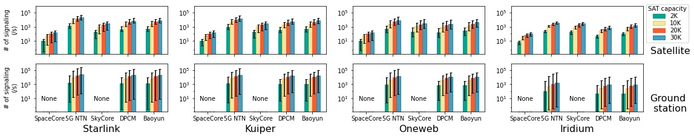

## Figure 19:  Signaling migration overhead per satellite and per ground station in five solutions.

### Overview

Figure 20 shows signaling migration overhead without failures/attacks.
This figure is to compare  SpaceCore with other four satellite solutions in LEO mega-constellations in Tabel 1.
SpaceCore significantly reduces signaling overhead compared to the other four solutions. It reduces 122.2×, 17.5×, 40.3×, and 49.3×signaling costs for satellites compared to 5G NTN, SkyCore, Baoyun, and DPCM, respectively in Starlink where capability of satellite is 30,000 users. SpaceCore eliminates the remote ground stations’s performance bottlenecks due to space-terrestrial asymmetry.

### Experimental Methodology

We run SpaceCore in LEO mega-constellations in Table 1 (based on real orbital information from  [Space-track](https://www.space-track.org)) and ground stations in [1](#refer-anchor-1). We assume the LEO mega-constellations use the grid satellite topology with inter-satellite traffic delivery capability. We replay signaling datasets in Table 2 to trigger their signaling procedures. We repeat this experiment in SpaceCore and other solutions in §6.1 under varying LEO satellite capacities. 

### How to run the code

1.    jupyter notebook
2.    Open figure20.ipynb file and run notebook

### Data
The data can be found in the `data/` folder.

	|- data
		|- starlink_72_22
			|- opt_handover
				|- satellite
					|- distributed_solution_DPCM_state_2000_mobility.npy：This file shows signaling migration overhead in solution DPCM with capacity of 2000 during mobility management. Shape of this file is (99, 1584, 2), which contains byte migration overhead and signaling migration overhead during 99 sets of time slice switching, on 1584 satellites.
					|- distributed_solution_DPCM_state_2000_session.npy
					...
			|- distributed_new-end_SP_delay_hop.npy:llx
		|- kuiper
			|- opt_handover
				|- satellite
					|- distributed_solution_DPCM_state_2000_mobility.npy.npy
					...
			|- distributed_new-end_SP_delay_hop.npy
		...

### Reference

- [1] Tesmanian. SpaceX Starlink Gateway Stations Found In The United States and Abroad. https://tinyurl.com/4m5uah43, 2021.

