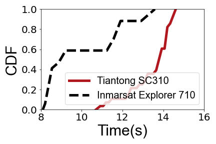

## Figure 5b: Registration signaling latency

<div align=center></div>


### What is this figure about
Figure 5b show 9.5s and 13.5s average registration delays in Inmarsat and Tiantong.
This figure is to illustrate the high signaling latency of the current bent-pipe mode of GEO satellites.
Such latency cannot meet 5G’s stringent radio baseband processing (≤10 ms) and signaling deadlines.

### Experimental methodology
Our experiments are based on trace from China Telecom Tiantong SC310 and Inmarsat BGAN Explorer 710. 
We follow the standards (e.g. UMTS) to determine the start and end of the registration process.

### How to run the code
```
jupyter notebook
open figure5b.ipynb file and run notebook
```

### Data
The data can be found in the `data/` folder.

	|- data
		|- explore-710
			|- 1-8-2022
				|- 1.txt: Each file contains two lines, the signaling of the registration request and the the registration completion.
			|- 1-14-2022
			|-...
		|- tiantong-sc310
			|-...
