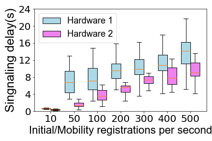
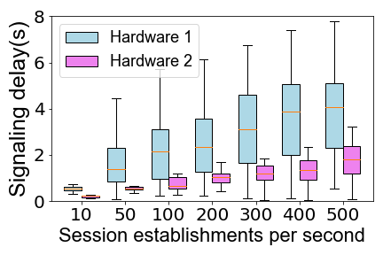

## Figure 8: Signaling latency in hardware by satellites

<div align=center></div>

### Overview

This figure shows massive signalling procedures will delay all users’ services (initial/mobility registration and session establishment)  by queuing. We initiate procedures with varying number of users to evaluate 5G core(Open5GS) performance.
This motivates us to reduce the signaling latency in SpaceCore.

### Experimental Methodology

We use real LEO hardware to run a lightweight 5G core network, Open5GS, to illustrate the 5G core performance. Even for a lightweight core network, the signalling delay is high.

Here are the experiment details:

+ Hardware: (1) Raspberry Pi 4 used by Baoyun 5G LEO satellite and; (2)
Precision 7920 Workstation with Xeon E5-2630 (20 cores, 2.2GHz), which is  similar to (weaker than) Hewlett Packard Enterprise EL 8000s (24 cores, 2.4GHz) used by OrbitsEdge in satellites.
+ Software: [Open5GS](https://open5gs.org) and [UERANSIM](https://github.com/aligungr/UERANSIM).
+ Reproduction steps:
	1. Deploy all functions of Open5GS on hardware 1/2, and deploy UERANSIM on any hardware (different from the hardware where Open5GS is located).
	2. Establish connections between Open5GS and UERANSIM.There are many tutorials available on how to establish connections between the them, such as:
		+ [My first 5G Core : Open5GS and UERANSIM](https://nickvsnetworking.com/my-first-5g-core-open5gs-and-ueransim/)
		+ [Open5GS 5GC & UERANSIM UE/RAN Sample Configuration](https://github.com/s5uishida/open5gs_5gc_ueransim_sample_config)
		+ [Open5GS & UERANSIM - Select nearby UPF according to the connected gNodeB](https://github.com/s5uishida/open5gs_5gc_ueransim_nearby_upf_sample_config)
	3. Write scripts to insert users in batches and trigger registration signaling processes.
	4. Get signaling delay based on UERANSIM and Open5GS logs.
	5. Processing data, calculating the signaling delay of each procedure on two hardware.


### How to run the code
```
jupyter notebook
open figure8.ipynb file and run notebook
```

### Data
The following data files can be found in the `data/` subfolder:

	|- data
		|- registration: The logs collected with UERANSIM of registration on the UE side, based on the following two hardware devices.
			|- raspberry-pi: Raspberry pi 4B
				|- 10.txt: The file name `xxx.txt` indicates `xxx` registration/session establishment requests sent per second.
				|- 50.txt
				|-...
			|- work-station: Precision 7920 Workstation with Xeon E5-2630(20 cores, 2.2GHz)
		|- session: The logs collected with UERANSIM of session estblishment on the UE side, based on the following two hardware devices.
			|- raspberry-pi
			|- work-station
