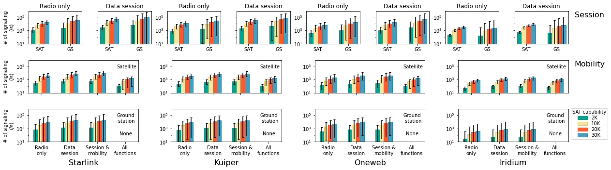

## Figure 9: Signaling migration overhead of satellite and ground station in four constellations.

<div align=center></div>

### What is this figure about
Figure 9 shows signaling migration overhead of satellite and ground station in four constellations.

This figure is to compare orbital cores in Figure 6 in LEO mega-constellations. Each LEO satellite must process $10^4$∼$10^5$ signaling messages/s (depending on satellite capacity, location, and constellations). This cost is worsened at the ground stations by one order of magnitude due to space-terrestrial asymmetry (except for Option 4). Without mobility functions in satellites (Figure 6a–6b), signaling storms arise from the stateful session establishment.

### Experimental Methodology
We analyze four options of orbital core from 3GPP standards and 5G satellites by progressively adding radio, session, mobility, and security functions to satellites (Figure 6). 

Rather than spread these functions to multiple satellites, we focus on consolidating them to each satellite that is coherent with today’s 5G satellites to save signaling costs.  We run what-if studies for each option by replaying datasets from terrestrial 5G (Table 2, collected by MobileInsight) and global mobile subscriptions in ground stations in [<sup>1</sup>](#refer-anchor-1) (as home network) and LEO mega-constellations in Table 1 using grid topology.

### How to run the code
```
jupyter notebook
Open figure9.ipynb file and run notebook
```

### Data
The data can be found in the `data/` folder.

	|- data
		|- gsl_mobility_signaling.npy:This file shows signaling migration overhead during mobility management in ground station-satellite-link.
		|- gsl_session_signaling.npy:This file shows signaling migration overhead during session setup in ground station-satellite-link.
		|- starlink_72_22
			|- opt_handover
				|- satellite
					|- distributedscenario_a_2000_mobility.npy：This file shows signaling migration overhead in scanario a with capacity of 2000 during mobility management. Shape of this file is (99, 1584, 2), which contains byte migration overhead and signaling migration overhead during 99 sets of time slice switching, on 1584 satellites.
					|- distributedscenario_a_2000_session.npy
					...
		|- kuiper
			|- opt_handover
				|- satellite
					|- distributedscenario_a_2000.npy
					...
		...

### Reference

<div id="refer-anchor-1"></div>- [1] Tesmanian. SpaceX Starlink Gateway Stations Found In The United States and Abroad. https://tinyurl.com/4m5uah43, 2021.

