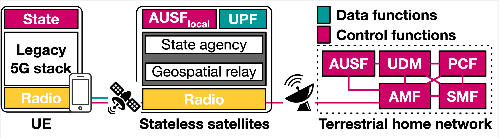

# A Case for Stateless Mobile Core Network Functions in Space

This repository collects the artifacts of the SIGCOMM'22 paper "A Case for Stateless Mobile Core Network Functions in Space."

## Paper Abstract
Is it worth and feasible to push mobile core network functions to low-earth-orbit (LEO) satellite mega-constellations? While this paradigm is being tested in space and promises new values, it also raises scalability, performance, and security concerns based on our study with datasets from operational satellites and 5G. A major challenge is today’s stateful mobile core, which suffers from signaling storms in satellites’ extreme mobility, intermittent failures in outer space, and attacks when unavoidably exposed to untrusted foreign locations. To this end, we make a case for a stateless mobile core in space. Our solution, SpaceCore, decouples states from orbital core functions, simplifies location states via geospatial addressing, eliminates unnecessary state migrations in satellite mobility by shifting to geospatial service areas, and localizes state retrievals with device-as-the-repository. Our evaluation with datasets from operational satellites and 5G shows SpaceCore’s 17.5× signaling reductions and resiliency to failures/attacks compared to existing solutions.

<div align=center></div>


## Repository structure

This repository is composed of the following parts

	|- SpaceCore-SIGCOMM22
		|- Dataset
			|-Satellite terminal data: signaling datasets from operational satellites.
			|-Mobileinsight dataset:
		|- Figures-and-Tables: Source files of figures and tables in [1]
			|-Figure5b
			|-Figure7
			|-Table2
			|-...
		|- sigcomm22.pdf: The SIGCOMM'22 paper.
		|- SpaceCore-overview.png: SpaceCore overview.
		|- README.md: This file.
	
	
## Dataset


We use two datasets for the empirical study and evaluation (released in `SpaceCore-SIGCOMM22/Dataset/`):

- **Satellite terminal dataset**: The dataset is collected from three satellite termainals: China Telecom Tiantong SC310, China Telecom Tiantong 
T900 and Inmarsat BGAN Explorer 710 in 04/2021–1/2022.  
- **Mobileinsight dataset**: @yimei.

<table>
<thead>
  <tr>
    <th></th>
    <th colspan="3"> Mobile satellites</th>
    <th colspan="3"> Terrestrial 5G</th>
  </tr>
</thead>
<tbody>
  <tr>
    <td></td>
    <td>Inmarsat Explorer 710</td>
    <td>Tiantong SC310</td>
    <td>Tiantong T900</td>
    <td>China Telecom</td>
    <td>China Unicom</td>
    <td>China Mobile</td>
  </tr>
  <tr>
    <td>L1/L2</td>
    <td>33,845</td>
    <td>1,178,327</td>
    <td>2,759,859</td>
    <td>3,828,083</td>
    <td>1,475,393</td>
    <td>8,405,587</td>
  </tr>
  <tr>
    <td>RRC<br></td>
    <td>4,484</td>
    <td>9,583</td>
    <td>3,020</td>
    <td>28,841</td>
    <td>14,833</td>
    <td>69,782</td>
  </tr>
  <tr>
    <td>MM</td>
    <td>57,264</td>
    <td>46,139</td>
    <td>13,556</td>
    <td>605</td>
    <td>970</td>
    <td>4,194</td>
  </tr>
  <tr>
    <td>SM</td>
    <td>48,458</td>
    <td>4,586</td>
    <td>1,670</td>
    <td>203</td>
    <td>338</td>
    <td>925</td>
  </tr>
  <tr>
    <td>Total</td>
    <td>946,860</td>
    <td>2,311,663</td>
    <td>4,885,375</td>
    <td>3,857,732</td>
    <td>1,491,534</td>
    <td>8,480,488</td>
  </tr>
</tbody>
</table>

## Figures and Tables

In `SpaceCore-SIGCOMM22/Figures-and-Tables/`, we release the traces used in [1]'s figures and tables, including

- Figure5b: Measurement registration signaling latency in Tiantong SC310 and Inmarsat Explorer 710.
- Figure7: CPU usages by core network functions.
- Figure8: Signaling latency(Initial/Mobility registrations and Session establishments) in two hardware by satellites.
- Figure9: Signaling migration overhead of satellite and ground station in four constellations.
- Figure12: Temporal dynamics of a fast-moving LEO satellite’s signaling overhead in Option 3(Figure 6c).
- Figure13: Satellite failures in Starlink and radio link failures in Tiantong T900.
- Figure17: Singnaling delay and satellite CPU usage of initial registration, session establishment and mobility registration (by LEO satellite mobility). 
- Figure18: SpaceCore’s local state processing costs.
- Figure19: Leaked sensitive states in satellite attacks.
- Figure20: Signaling migration overhead per satellite and per ground station in five solutions.
- Table2: Overview of dataset from our experiments.
- Table4: SpaceCore’s satellite signaling cost reduction.

Each table/figure has a README in the folder that describes how to run our code, and the methodology of our experiments.

## Dependencies

We have placed the experimental code and data in the Figures-and-Tables folder.
All code in this repository runs in **python3** and **jupyter notebook** environment. The following are dependencies:

```
pip3 install matplotlib numpy statsmodels pandas scipy seaborn
```


## Experimental methodology

We describe the experimental methodology in three parts, for more details please refer to the paper [1] and README of each figure/table in Figures-and-Tables folder.

### Empirical study
In §3, we analyze four options of orbital core from 3GPP standards and 5G satellites by progressively adding radio, session, mobility, and security functions to satellites (Figure 6). 
We run what-if studies for each option by replaying datasets from operational satellites and terrestrial 5G (Table 2, collected by MobileInsight  and equipment in Figure 4b) and global mobile subscriptions in ground stations in (as home network) and LEO mega-constellations in Table 1 using grid topology  and a testbed running open5gs on two commodity hardware in real LEO satellites (detailed in §6).

### Prototype Evaluation


We follow §4–5 to prototype SpaceCore with [Open5GS](https://open5gs.org) and [OpenABE](https://github.com/zeutro/openabe) on two hardware: (1) Raspberry Pi 4 used by Baoyun 5G LEO satellite and; (2)
Precision 7920 Workstation with Xeon E5-2630 (20 cores, 2.2GHz), which is similar to (weaker than) Hewlett Packard Enterprise EL 8000s (24 cores, 2.4GHz) used by OrbitsEdge in satellites.

For prototype evaluation, we first examine SpaceCore’s functionality in a small network with a home running full-fledged 5G protocol stacks in a ThinkStation P910, a SpaceCore satellite with Raspberry Pi 4, and terrestrial UEs emulated by [UERANSIM](https://github.com/aligungr/UERANSIM). We initiate procedures in Figure 10 and 16 with varying number of users to evaluate SpaceCore’s performance and cost. 


### Emulation in LEO Mega-Constellations


To assess SpaceCore at scale, we run SpaceCore in LEO mega-constellations in Table 1 (based on real orbital information from [Space-Track](https://www.space-track.org)) and ground stations in [this link](https://tinyurl.com/4m5uah43) by replaying the above satellite/5G datasets.
 
We assume the LEO mega-constellations use the grid satellite topology with inter-satellite traffic delivery capability. We run UERANSIM with SpaceCore to emulate global mobile subscriptions statistics and replay signaling datasets in Table 2 to trigger their signaling procedures. We repeat this experiment in SpaceCore and other solutions in §6.1 under varying LEO satellite capacities. Figure 20 shows the signaling costs without failures/attacks, and Figure 19 shows the resiliency to satellite attacks.


## Full dataset access
Due to excessive data volume, we do not intend to release all raw data here. If you want more data, please send a request to yuanjiel@tsinghua.edu.cn.

The request should include the work department, the purpose of data usage, and the data content obtained.

## References

[1] Yuanjie Li, Hewu Li, Wei Liu, Lixin Liu, Yimei Chen, Jianping Wu, Qian Wu, Jun Liu, Zeqi Lai. A Case for Stateless Mobile Core Network Functions in Space. ACM SIGCOMM 2022.

